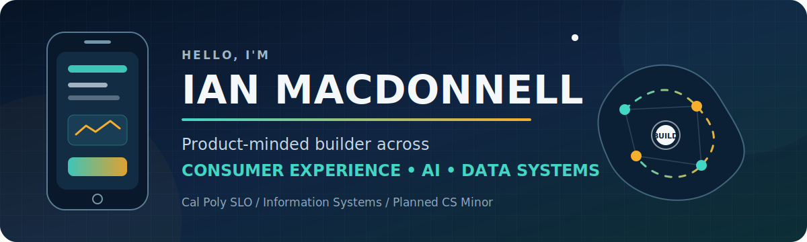
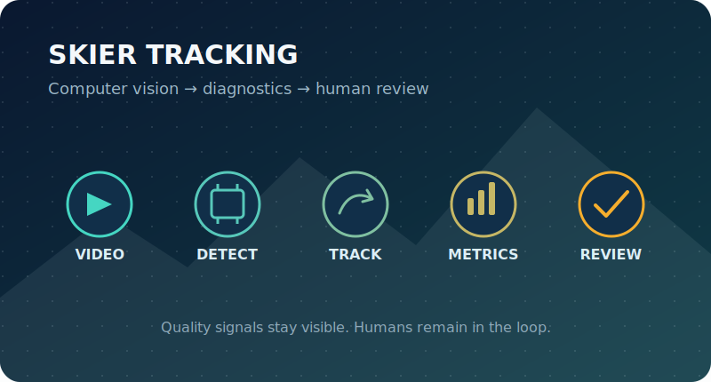

  

  
  
  

## A little about me

I am an **Information Systems student at Cal Poly** planning a Computer Science minor. I build consumer experiences, AI products, and data systems where user needs and technical constraints meet. I am especially interested in messy problems involving unreliable connectivity, noisy data, and changing requirements.

I also write as an **Opinion Columnist for Mustang News** and serve as **VP of Tech Development for Cal Poly's Product Management Club**. Both roles keep communication, user empathy, and product judgment central to how I work.

> **What I am exploring now:** product engineering, technical product management, consumer experience, and applied AI/data systems opportunities for Summer 2027.

## Selected work

<table>
  <tr>
    <td width="50%" valign="top">
      
      <h3>Opportunity OS</h3>
      
Built a privacy-first internship tracker that ranks opportunities using fit, career signal, recency, urgency, and network strength.

      

        <a href="https://ianrmacdonnell.github.io/internship-opportunity-tracker/"><b>Live demo</b></a> ·
        <a href="https://github.com/IanRmacdonnell/internship-opportunity-tracker"><b>Repository</b></a>
      

      JavaScript · Vite · Local-first data · Product analytics
    </td>
    <td width="50%" valign="top">
      
      <h3>Clamor</h3>
      
Built an AI memory layer that turns noisy community chat into digests, action items, onboarding briefs, alerts, and source-backed answers.

      

        <a href="https://ianrmacdonnell.github.io/clamor-ai-memory-layer/"><b>Case study</b></a> ·
        <a href="https://github.com/IanRmacdonnell/clamor-ai-memory-layer"><b>Repository</b></a>
      

      Node.js · Retrieval · AI product design · Full-stack
    </td>
  </tr>
  <tr>
    <td width="50%" valign="top">
      
      <h3>Skier Tracking Pipeline</h3>
      
Built a computer-vision pipeline for skier detection, tracking diagnostics, quality metrics, and human-in-the-loop label review.

      

        <a href="https://ianrmacdonnell.github.io/skier-tracking-yolov8-pipeline/"><b>Case study</b></a> ·
        <a href="https://github.com/IanRmacdonnell/skier-tracking-yolov8-pipeline"><b>Repository</b></a>
      

      Python · YOLOv8 · OpenCV · Data engineering
    </td>
    <td width="50%" valign="top">
      
      <h3>AI Story Visualization Pipeline</h3>
      
Built a provider-neutral pipeline that turns source text into traceable visual storyboards with continuity checks and reproducible Story Bibles.

      

        <a href="https://ianrmacdonnell.github.io/ai-story-visualization-pipeline/"><b>Case study</b></a> ·
        <a href="https://github.com/IanRmacdonnell/ai-story-visualization-pipeline"><b>Repository</b></a>
      

      Python · NLP · Generative AI · Creative tooling
    </td>
  </tr>
</table>

## Tools I reach for

  

`React Native` · `Expo` · `EAS Build` · `TestFlight` · `JavaScript` · `TypeScript` · `React Navigation` · `NFC` · `Supabase` · `Expo SecureStore` · `AsyncStorage` · `NetInfo` · `Jest` · `Python` · `SQL` · `PostgreSQL` · `AWS` · `Git` · `Product discovery`

## A note on private work

Some production and client work is private. Every project featured here is standalone and sanitized, using synthetic or public-domain material. None include proprietary code, credentials, or private data.

## Let's connect

Want to talk about thoughtful consumer experiences, applied AI, or data systems? Reach me on [LinkedIn](https://www.linkedin.com/in/ian-macdonnell-832a01236/).
